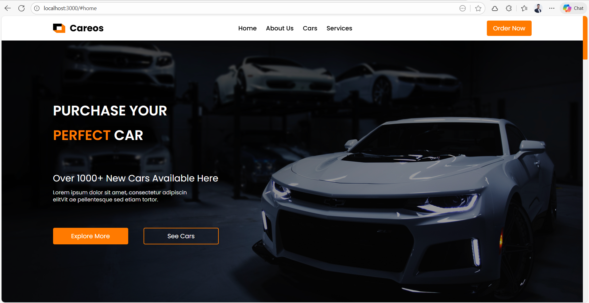

# Cars Gallery Landing Page - DRB internship project

This is a landing page project for a Cars Gallery, created as part of the DRB internship program. The project showcases a collection of cars with images and descriptions.



## Cars Gallery Landing Page - Live Demo

**Live Demo:** [https://cars-gallery-landing-page.vercel.app/](https://cars-gallery-landing-page.vercel.app/)

## Tech Stack

- **Next.js** - A React framework for building server-side rendered applications.
- **Tailwind CSS** - A utility-first CSS framework for rapid UI development.

## Features

- Responsive design for optimal viewing on various devices.
- Clean and modern UI showcasing car images and descriptions.
- Easy navigation with smooth scrolling.
- Optimized for performance and fast loading times.

## Installation

To run this project locally, follow these steps:

1. Clone the repository:
   ```bash
   git clone https://github.com/Abdelaziz-Mohammed/cars-gallery-landing-page.git
   ```
2. Navigate to the project directory:
   ```bash
   cd cars-gallery-landing-page
   ```
3. Install the dependencies:
   ```bash
   npm install
   ```
4. Start the development server:
   ```bash
   npm run dev
   ```
5. Open your browser and visit `http://localhost:3000` to view the landing page.

## Author

**Eng. Abdelaziz Mohamed**

- [LinkedIn](https://www.linkedin.com/in/abdelaziz)
- [GitHub](https://github.com/Abdelaziz-Mohammed)
